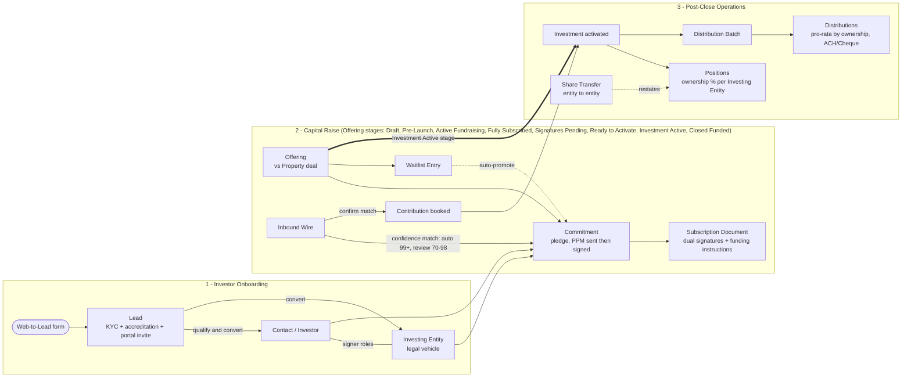
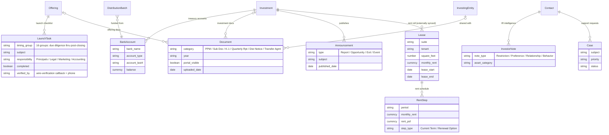

# DPEG Investor Relations — Logical Business ERD

*The logical business data model of the DPEG Investor Relations application, inferred from the application's user interface and business workflow.*

| | |
|---|---|
| **Client** | Dhanani Private Equity Group (DPEG) |
| **Application** | Investor Relations (IR) |
| **Document** | Logical Business Entity-Relationship Diagram |
| **Version** | 1.0 |
| **Date** | 2026-07-29 |
| **Prepared by** | Avanza Solutions |

---

## 1. Purpose & Method

This document defines the **logical business data model** of the DPEG Investor Relations application, for inclusion in the Functional Solution Design (FSD) and as reference input to the Solution Design Document (SDD). It gives business stakeholders and delivery teams a shared, sign-off-ready picture of *what the business manages* — investors, offerings, commitments, funding, positions, and payouts — independent of how any platform stores it.

**This is a logical business model — explicitly *not* a reverse-engineered platform schema.** The underlying org contains duplicate fields and legacy design decisions that do not represent the intended business model; those were deliberately excluded. No entity or relationship in this document was taken from lookup or master-detail metadata. Instead, **every entity and every relationship is justified by what the application visibly presents to its users.**

The model was inferred from the following UI sources and then adversarially verified against them:

- The **Offering**, **Investment**, **Investing Entity**, and **Contact** record pages, including every tab and embedded component (LWC) on each;
- The **IR console workspaces** (onboarding queue, wire matching, distributions, payments);
- The **end-to-end business workflow** as demonstrated in the application: web-to-lead intake → onboarding → capital raise → activation → post-close operations.

Where a relationship is visible only as a state change (e.g. a flag flipping when another record is created), it is drawn as an **inferred process edge** and flagged for client confirmation in Appendix B.

---

## 2. Reading Guide

**Edge styles**

- **Solid edges** — structural business relationships: one entity durably references or contains the other.
- **Dashed edges** — process edges: one entity *creates*, *promotes*, *restates*, *converts into*, or otherwise flows into the other as part of a business process, without a permanent structural container.

**Zone legend**

| Zone | Contents |
|---|---|
| **Party & Investor** | Lead, Contact, Investing Entity, Entity-Contact Role |
| **Capital Raise** | Offering, Commitment, Waitlist Entry, Wire, Subscription Document |
| **Post-Close Operations** | Investment, Position, Contribution, Distribution Batch, Distribution, Share Transfer |
| **Asset** | Property |
| *Supporting zones* | Treasury (Bank Account) · Docs & Comms (Document, Announcement) · Operations (Launch Task, Investor Note, Case, Lease, Rent Step) |

**Derived paths intentionally NOT drawn**

1. **Contact → Investment is derived, not direct.** The Contact page's "Investments" tab traverses Contact → Entity-Contact Role → Investing Entity → Position → Investment. There is no direct edge between a person and an investment; capital always flows through a legal vehicle.
2. **Contact-page investor KPIs are roll-ups.** The lifetime-invested and totals figures shown on the Contact page are aggregations computed over that same traversal path — they are derived analytics, not stored relationships.

---

## 3. Core Business ERD

The core model comprises sixteen entities across the four primary zones.

```mermaid
erDiagram
    %% ===== PARTY / INVESTOR ZONE =====
    Lead {
        string channel "Web-to-Lead / Email-to-Lead / Referral"
        string kyc_status "Awaiting Docs / Accreditation Pending / Verified"
        string portal_invite_status
        string onboarding_status "New / Under Review"
    }
    Contact {
        string accreditation_status
        string kyc_status
        string investor_tier "Anchor / Active / Dormant"
        boolean portal_activated
        boolean repeat_investor
    }
    InvestingEntity {
        string entity_type "Individual / Corp / Trust / LLC / IRA / Exempt Org"
        string country
    }
    EntityContactRole {
        string signer_role "Primary / Secondary"
        boolean is_primary
        boolean signature_required
    }

    %% ===== CAPITAL RAISE ZONE =====
    Offering {
        string stage "8-stage: Draft to Closed Funded"
        currency target_raise
        currency price_per_share
        currency minimum_investment
        date closing_date
        string gp_entity
    }
    Commitment {
        currency committed_amount
        date commitment_date
        string membership "GP / LP / Member / Manager"
        boolean ppm_sent
        boolean ppm_signed
        boolean funded
    }
    WaitlistEntry {
        number share_count
        currency amount
        boolean auto_promote
        string status "Waitlisted / Promoted / Withdrawn"
    }
    Wire {
        string sender
        currency amount
        string memo
        number match_confidence "auto 99+ / review 70-98 / unmatched below 70"
        string match_status
    }
    SubscriptionDocument {
        string primary_signature "Pending / Sent / Signed"
        string secondary_signature
        boolean finalized
        string funding_instructions "Locked / Sent"
    }

    %% ===== POST-CLOSE OPERATIONS ZONE =====
    Investment {
        string status "Active / Closed"
        date start_date
        currency lp_capital
        currency dpeg_stake
        percent irr_to_date
        percent target_irr
    }
    Position {
        percent ownership
        currency committed
        currency contributed
        currency distributed
        currency unreturned_capital
        string state "Current / Past + change reason"
    }
    Contribution {
        currency amount
        date contribution_date
        string type "Full / Partial"
        string payment_method "ACH / Wire / Cheque"
    }
    DistributionBatch {
        string source "Cash Flow / Redemption / Refinance / Sale"
        string type "Preferred Return / RoC / Catch Up / Fee / Interest"
        string period
        currency total_amount
        string status
    }
    Distribution {
        currency amount
        string method "ACH / Cheque"
        string ach_status
        string paid_status
        date distribution_date
    }
    ShareTransfer {
        number shares_to_transfer
        currency sale_price
        currency purchase_price
        string transfer_type "Full / Partial"
        string status "Pending e-sig / IR Approval / Completed"
    }

    %% ===== ASSET ZONE =====
    Property {
        string property_type "Retail / Office / Industrial / Mixed-Use ..."
        string address
        number units
        number square_feet
        currency valuation
        percent occupancy
    }

    %% ===== PARTY RELATIONSHIPS =====
    Lead ||..o| Contact : "converts to"
    Lead ||..o| InvestingEntity : "converts to"
    Contact ||--o{ EntityContactRole : "acts through"
    InvestingEntity ||--o{ EntityContactRole : "has signers"

    %% ===== CAPITAL RAISE RELATIONSHIPS =====
    Property ||--o{ Offering : "backs"
    Offering ||--o{ Commitment : "receives"
    Contact ||--o{ Commitment : "pledged by"
    InvestingEntity ||--o{ Commitment : "pledged via"
    Offering ||--o{ WaitlistEntry : "overflow queue"
    Contact ||--o{ WaitlistEntry : "requested by"
    InvestingEntity ||--o{ WaitlistEntry : "requested via"
    WaitlistEntry |o..o| Commitment : "auto-promotes to (inferred)"
    Offering ||--o{ Wire : "receives funds"
    Wire }o..o| Commitment : "matched against"
    Wire |o..o| Contribution : "creates on confirm"
    Offering ||--o{ SubscriptionDocument : "collects"
    SubscriptionDocument }o--|| InvestingEntity : "signed by"
    SubscriptionDocument |o..|| Commitment : "executes (inferred)"

    %% ===== POST-CLOSE RELATIONSHIPS =====
    Offering ||..o{ Investment : "activates into (business flow)"
    Investment }o--|| Property : "holds"
    Investment ||--o{ Position : "divided into"
    InvestingEntity ||--o{ Position : "holds"
    Investment ||--o{ Contribution : "capital received"
    InvestingEntity ||--o{ Contribution : "contributes"
    Contribution }o..o| Commitment : "fulfills (inferred, sets Funded)"
    Investment ||--o{ DistributionBatch : "pays out via"
    DistributionBatch ||--o{ Distribution : "allocates pro-rata"
    InvestingEntity ||--o{ Distribution : "receives"
    Investment ||--o{ ShareTransfer : "within"
    InvestingEntity ||--o{ ShareTransfer : "transferor"
    InvestingEntity ||--o{ ShareTransfer : "transferee"
    ShareTransfer }o..o{ Position : "restates"
```

**Deliberate modeling notes**

- **(a) Contact ↔ Investment is derived, not drawn.** As explained in §2, a person reaches an investment only through their investing entity's position. Drawing a direct edge would misstate the business rule that capital is held by legal vehicles, not by individuals.
- **(b) Investment → Property is a direct edge.** The Investment page presents the property itself — type, address, units, occupancy, valuation — and contains **no reference to the originating Offering**. Consequently, Offering → Investment is drawn as a dashed *business-flow* edge: an Offering, once fully subscribed and activated, results in one or more Investments (typically one per offering in the current application).
- **(c) Inferred process edges are flagged for sign-off.** Three edges — Waitlist promotion → Commitment, Subscription Document ↔ Commitment, and Contribution fulfills Commitment — are supported by UI state flags (status transitions, PPM-signed and Funded milestones), but the causal link itself is a business inference rather than an on-screen fact. Each is flagged for client confirmation in Appendix B.

---

## 4. Business Flow Overlay

The overlay below places the core entities on the operational timeline: onboarding, raise, and post-close.

This overlay maps directly onto the client's seven-step operating narrative: a prospect arrives through the **Web-to-Lead intake** (step 1) and is worked through KYC, accreditation, and portal invitation before **Lead conversion** into a Contact and Investing Entity (steps 2–3). The IR team then runs the **Offering through its eight stages** — collecting commitments, managing the waitlist, matching inbound wires, and executing subscription documents (steps 4–5) — until the offering **activates into one or more Investments** (step 6). From there, **ongoing operations** take over: contributions are booked, distribution batches pay out pro-rata by ownership, and share transfers restate positions between entities (step 7).

---

## 5. Supporting Entities ERD (8 entities)

Eight supporting entities carry treasury, documentation, communications, and operational detail. The anchors shown without attributes (Offering, Investment, Investing Entity, Distribution Batch, Contact) are **ghost entities** — attribute-suppressed here; their full definitions appear in the core diagram in §3.

**Notes**

- **Lease rows are units/suites**, not only signed leases — vacant units appear on the rent roll without a tenant or lease term.
- **The rent roll is externally mastered.** It is surfaced on the Investment page with a "last synced" timestamp; the data is mastered in the property-management system (Yardi, delivered via ASB) and is **read-only** in this application.
- **NNN cost components** — tax, insurance, and CAM monthly charges — are Lease attributes; they are detailed in the entity dictionary (§6) rather than shown in the diagram.
- **Presentation and Communications tabs fold into Document.** The Offering page's Presentation and Communications tabs are generic file-attachment lists; they are modeled as Document rows, not separate entities.
- **Bank Account belongs to exactly one Investment.** Each deal carries its own treasury accounts (LP and GP accounts per deal); distribution batches are funded from one of them.

---

## 6. Entity Dictionary

| Entity | Zone | Business definition | Key attributes | Lifecycle? |
|---|---|---|---|---|
| **Lead** | Party & Investor | A prospective investor captured via web form, inbound email, or referral; carries KYC, accreditation, and portal-invitation tracking until qualified and converted. | Channel; KYC status; portal invite status; onboarding status | Yes — A.2 |
| **Contact** | Party & Investor | The investor as a person: accreditation and KYC standing, relationship tier, portal activation, repeat-investor status. *One logical entity — the physical schema materializes a separate Investor summary profile (tier, KYC, lifetime metrics); folded here as attributes.* | Accreditation status; KYC status; investor tier (Anchor / Active / Dormant); portal activated; repeat investor | Tier progression only |
| **Investing Entity** | Party & Investor | The legal vehicle — individual, corporation, trust, LLC, IRA, or exempt organization — through which all capital is committed, contributed, held, and distributed. | Entity type; country | No |
| **Entity-Contact Role** | Party & Investor | The signer relationship binding a person to an investing entity: who may act for the vehicle and whose signature is required. | Signer role (Primary / Secondary); is-primary; signature required | No |
| **Offering** | Capital Raise | A capital raise run against a property deal, managed through an eight-stage lifecycle from Draft to Closed Funded; defines the raise economics (target, share price, minimum ticket, closing date) and names the GP entity. | Stage; target raise; price per share; minimum investment; closing date; GP entity | Yes — A.1 |
| **Commitment** | Capital Raise | An investor's pledge of capital to an offering, made by a person via an investing entity; tracks membership class and the PPM-sent → PPM-signed → Funded milestones. | Committed amount; commitment date; membership (GP / LP / Member / Manager); PPM sent / signed; funded | Yes — A.3 |
| **Waitlist Entry** | Capital Raise | An allocation request queued against a fully subscribed offering; may auto-promote into a commitment when allocation frees up. | Share count; amount; auto-promote; status | Yes — A.6 |
| **Wire** | Capital Raise | An inbound funding wire received against an offering; matched to a commitment by confidence score and, on confirmation, booked as a contribution. | Sender; amount; memo; match confidence; match status | Yes — A.4 |
| **Subscription Document** | Capital Raise | The subscription agreement executed by an investing entity for an offering; tracks each signer's signature state, funding-instruction release, and finalization. | Primary / secondary signature states; finalized; funding instructions | Yes — A.5 |
| **Investment** | Post-Close Operations | The active deal after close: LP capital, DPEG's stake, and IRR performance against target. The operating anchor for positions, contributions, distributions, and transfers. | Status; start date; LP capital; DPEG stake; IRR to date; target IRR | Yes — A.7 |
| **Position** | Post-Close Operations | An investing entity's ownership stake in an investment: ownership %, committed / contributed / distributed capital, and unreturned capital. Historical states preserved with change reasons. *Committed and net-equity figures also surface on the Investing Entity page.* | Ownership %; committed; contributed; distributed; unreturned capital; state | Yes — A.11 |
| **Contribution** | Post-Close Operations | Capital actually received into an investment from an investing entity — full or partial, by ACH, wire, or cheque. | Amount; contribution date; type; payment method | No |
| **Distribution Batch** | Post-Close Operations | A payout event declared on an investment — sourced from cash flow, redemption, refinance, or sale — that allocates a total amount pro-rata across positions. | Source; type (Preferred Return / RoC / Catch Up / Fee / Interest); period; total amount; status | Yes — A.8 |
| **Distribution** | Post-Close Operations | An individual payout to one investing entity within a batch, with its own payment method and payment/ACH state. | Amount; method (ACH / Cheque); ACH status; paid status; distribution date | Yes — A.9 |
| **Share Transfer** | Post-Close Operations | A secondary, entity-to-entity transfer of shares within an investment — full or partial — moving through e-signature and IR approval before restating positions. | Shares to transfer; sale / purchase price; transfer type; status | Yes — A.10 |
| **Property** | Asset | The physical real estate asset underlying offerings and investments: type, location, scale, valuation, and occupancy. | Property type; address; units; square feet; valuation; occupancy | No |
| **Launch Task** | Operations (supporting) | A checklist item in the offering launch playbook — sixteen timing groups spanning due diligence through post-closing — with an assigned responsibility and a verification record. | Timing group; subject; responsibility; completed; verified by | Completed flag — A.12 |
| **Bank Account** | Treasury (supporting) | A deal treasury account (LP and GP accounts per investment) from which distribution batches are funded. | Bank name; account type; last-4; balance | No |
| **Document** | Docs & Comms (supporting) | Any deal or investor-facing file — PPM, sub doc, K-1, quarterly report, distribution notice, transfer agreement — with per-file portal visibility. | Category; year; portal visible; uploaded date | No |
| **Announcement** | Docs & Comms (supporting) | An investor communication published on an investment: reports, new opportunities, exit notices, events. | Type; subject; published date | No |
| **Investor Note** | Party & Investor (supporting) | IR relationship intelligence recorded against a person: restrictions, preferences, relationship history, and behavioral notes, optionally tagged by asset category. | Note type; asset category | No |
| **Case** | Operations (supporting) | An investor support request tracked through to resolution. | Subject; priority; status | Standard case states |
| **Lease** | Asset (supporting) | A suite/unit row on the investment's rent roll — tenant, area, rent, and term — externally mastered and read-only. *Carries NNN monthly cost components (tax / insurance / CAM) as attributes.* | Suite; tenant; square feet; monthly rent; lease start / end; NNN components | No |
| **Rent Step** | Asset (supporting) | A scheduled rent amount within a lease: current-term steps and renewal-option steps, with rent per square foot. | Period; monthly rent; rent PSF; step type | No |

---

## 7. Relationship Dictionary

All edges from both diagrams are cataloged below. Core relationships are numbered **R1–R31** (the transferor and transferee edges share one row, R30); supporting relationships are numbered **S1–S11**. UI evidence cites only visible application surfaces — never platform metadata.

### Core relationships (R1–R31)

| # | Relationship | Cardinality | Type | Business meaning | UI evidence |
|---|---|---|---|---|---|
| R1 | Lead → Contact ("converts to") | 1 : 0..1 | Process | A qualified lead converts into an investor person record. | Onboarding queue › lead conversion action; converted leads appear as Contacts |
| R2 | Lead → Investing Entity ("converts to") | 1 : 0..1 | Process | Conversion also establishes the legal vehicle the investor will invest through. | Onboarding queue › lead conversion action; entity created alongside the Contact |
| R3 | Contact → Entity-Contact Role ("acts through") | 1 : 0..N | Structural | A person may sign for multiple investing entities. | Investing Entity page › Associated Contacts (Primary, Required Signer columns) |
| R4 | Investing Entity → Entity-Contact Role ("has signers") | 1 : 0..N | Structural | An entity lists its authorized signers and their signature requirements. | Investing Entity page › Associated Contacts (Primary, Required Signer columns) |
| R5 | Property → Offering ("backs") | 1 : 0..N | Structural | Every raise is made against a specific property deal. | Offering page header and deal summary present the backing property |
| R6 | Offering → Commitment ("receives") | 1 : 0..N | Structural | Investor pledges accumulate against the offering's target raise. | Offering page › Prospects tab (committed rows with PPM / funded milestones) |
| R7 | Contact → Commitment ("pledged by") | 1 : 0..N | Structural | Each pledge is attributed to the person who made it. | Offering page › Prospects tab rows name the investor |
| R8 | Investing Entity → Commitment ("pledged via") | 1 : 0..N | Structural | The pledge is legally made through an investing entity with a membership class. | Offering page › Prospects tab rows show entity and membership (GP / LP / Member / Manager) |
| R9 | Offering → Waitlist Entry ("overflow queue") | 1 : 0..N | Structural | Once fully subscribed, further demand queues on the offering's waitlist. | Offering page › Waitlist tab (share count, amount, auto-promote) |
| R10 | Contact → Waitlist Entry ("requested by") | 1 : 0..N | Structural | Each waitlist request is attributed to a person. | Offering page › Waitlist tab rows name the investor |
| R11 | Investing Entity → Waitlist Entry ("requested via") | 1 : 0..N | Structural | The waitlisted allocation is requested through an investing entity. | Offering page › Waitlist tab rows show the entity |
| R12 | Waitlist Entry → Commitment ("auto-promotes to") | 0..1 : 0..1 | Process (inferred) | When allocation frees up, an auto-promote-enabled entry becomes a commitment. | Waitlist tab auto-promote toggle and "Promoted" status; causal link inferred — Appendix B Q5 |
| R13 | Offering → Wire ("receives funds") | 1 : 0..N | Structural | Inbound funding wires land against the offering being funded. | IR wire-matching workspace lists inbound wires per offering |
| R14 | Wire → Commitment ("matched against") | 0..N : 0..1 | Process | Each wire is matched to a candidate commitment by confidence score. | Wire record page match cards (confidence buckets: auto 99+, review 70–98, unmatched) |
| R15 | Wire → Contribution ("creates on confirm") | 0..1 : 0..1 | Process | Confirming a wire match books the funds as a contribution. | Wire record page match cards ("Confirm match & create contribution") |
| R16 | Offering → Subscription Document ("collects") | 1 : 0..N | Structural | The offering collects an executed subscription agreement per subscribing entity. | Offering page › Subscription Documents tab (per-signer status, funding instructions) |
| R17 | Subscription Document → Investing Entity ("signed by") | 0..N : 1 | Structural | Each subscription agreement is executed by exactly one investing entity. | Subscription Documents tab rows identify the signing entity |
| R18 | Subscription Document → Commitment ("executes") | 0..1 : 1 | Process (inferred) | The executed agreement formalizes a specific pledge. | Signature completion aligns with the commitment's PPM-signed milestone; causal link inferred — Appendix B |
| R19 | Offering → Investment ("activates into") | 1 : 0..N | Process (business flow) | A fully subscribed offering, once activated, results in one or more investments (typically one). | Offering stage "Investment Active"; the Investment page carries no offering reference — Appendix B Q1 |
| R20 | Investment → Property ("holds") | 0..N : 1 | Structural | The investment operates exactly one property. | Investment page presents the property profile directly (type, address, units, occupancy, valuation) |
| R21 | Investment → Position ("divided into") | 1 : 0..N | Structural | The investment's equity is divided into ownership positions. | Investment page › Positions / ownership table (ownership %, capital columns) |
| R22 | Investing Entity → Position ("holds") | 1 : 0..N | Structural | Each position is held by one investing entity; an entity may hold positions across deals. | Investing Entity page position summary; Contact page › Investments tab (rows traverse Investing Entity) |
| R23 | Investment → Contribution ("capital received") | 1 : 0..N | Structural | Contributions are booked into the investment they fund. | Investment page › Contributions tab (amount, date, method) |
| R24 | Investing Entity → Contribution ("contributes") | 1 : 0..N | Structural | Each contribution comes from a specific investing entity. | Contribution rows attribute funds to the entity |
| R25 | Contribution → Commitment ("fulfills") | 0..N : 0..1 | Process (inferred) | Booked contributions fulfill the original pledge and set it to Funded. | Commitment "Funded" flag flips when the contribution is booked; causal link inferred — Appendix B |
| R26 | Investment → Distribution Batch ("pays out via") | 1 : 0..N | Structural | Payout events are declared on the investment. | Investment page › Add Distribution (pro-rata by ownership %, bank account picker); Distributions tab |
| R27 | Distribution Batch → Distribution ("allocates pro-rata") | 1 : 0..N | Structural | The batch total is split into per-investor payouts by ownership %. | IR Distributions workspace drill-in (Method, ACH Status per payout) |
| R28 | Investing Entity → Distribution ("receives") | 1 : 0..N | Structural | Each payout line is paid to one investing entity. | Distributions workspace drill-in rows name the receiving entity |
| R29 | Investment → Share Transfer ("within") | 1 : 0..N | Structural | Transfers of shares occur within a single investment. | Investment page › Share Transfers tab |
| R30 | Investing Entity → Share Transfer ("transferor" / "transferee") | 1 : 0..N (each role) | Structural | Every transfer names a selling entity and a buying entity — two distinct edges, one per role. | Share Transfer page From / To entity panels (shares, sale and purchase price) |
| R31 | Share Transfer → Position ("restates") | 0..N : 0..N | Process | A completed transfer restates the affected positions' ownership. | Position state Current → Past with change reason "share transfer" following completion |

### Supporting relationships (S1–S11)

| # | Relationship | Cardinality | Type | Business meaning | UI evidence |
|---|---|---|---|---|---|
| S1 | Offering → Launch Task ("launch checklist") | 1 : 0..N | Structural | The offering carries its launch playbook of checklist tasks. | Offering page › Launch Checklist tab (16 timing groups, responsibility, verification) |
| S2 | Investment → Bank Account ("treasury accounts") | 1 : 0..N | Structural | Each deal maintains its own treasury accounts (LP and GP). | Investment page bank accounts panel (bank, type, last-4, balance) |
| S3 | Distribution Batch → Bank Account ("funded from") | 0..N : 1 | Structural | Every batch is funded from one of the deal's treasury accounts. | Investment page › Add Distribution bank account picker |
| S4 | Offering → Document ("offering docs") | 0..1 : 0..N | Structural | Offering files: PPM, presentations, communications. | Offering page › Documents, Presentation, and Communications tabs |
| S5 | Investment → Document ("investment docs") | 0..1 : 0..N | Structural | Deal reporting files: K-1s, quarterly reports, distribution notices. | Investment page › Documents tab (category, year, portal visibility) |
| S6 | Investing Entity → Document ("shared with") | 0..1 : 0..N | Structural | Files shared to a specific entity's portal view. | Document rows carry per-entity portal visibility |
| S7 | Investment → Announcement ("publishes") | 1 : 0..N | Structural | Investor communications published on the deal. | Investment page › Announcements tab (Report / Opportunity / Exit / Event) |
| S8 | Contact → Investor Note ("IR intelligence") | 1 : 0..N | Structural | Relationship intelligence recorded against the person. | Contact page IR notes panel (restrictions, preferences, behavior) |
| S9 | Contact → Case ("support requests") | 1 : 0..N | Structural | Investor support requests tracked per person. | Contact page › Cases tab (subject, priority, status) |
| S10 | Investment → Lease ("rent roll") | 1 : 0..N | Structural | The deal's rent roll of suites/units, externally synced and read-only. | Investment page › Rent Roll tab with "last synced" timestamp |
| S11 | Lease → Rent Step ("rent schedule") | 1 : 0..N | Structural | Each lease carries its scheduled rent steps. | Lease drill-in rent schedule (Current Term / Renewal Option steps, rent PSF) |

---

## 8. Modeling Decisions (fold/omit register)

The following UI artifacts were deliberately folded into existing entities or omitted from the logical model.

| Item | Decision | Rationale |
|---|---|---|
| Investor profile record | **Folded** into Contact | Same real-world person; tier, KYC, and lifetime totals are summary attributes surfaced on the IR console, not a distinct business concept. |
| GP Entity | **Attribute** of Offering | Appears as a details field only; has no page, lifecycle, or relationships of its own. |
| Transfer Document | **Folded** into Document (category "Transfer Agmt") | The transfer agreement surfaces via the Share Transfer page's Send-for-E-Signature action, not as an anchored document row. |
| PPM | **Folded** into Commitment flags (sent / signed) + Document category | The PPM's business significance is its send/sign milestones on the pledge; the file itself is a Document. |
| E-Signature Envelope & DocuSign recipient status | **Omitted** (process artifacts) | Signing state lands on Commitment and Subscription Document; the envelope itself carries no independent business meaning. See Appendix B Q7. |
| Investor Preferences (asset types / return criteria / geography) | **Attribute cluster** on Contact | Preference data qualifies the investor; it has no lifecycle or relationships. |
| Presentation & Communications tabs | **Folded** into Document | Generic file-attachment lists on the Offering page. |
| Onboarding queue / workspace | **View** over the Lead pipeline | The workspace filters and sorts leads by status, channel, and KYC attributes — no new entity. |
| Payments workspace & transaction ledger | **Derived view** over Wire + Contribution + Distribution + Bank Account | A consolidated money-movement lens; every row resolves to an existing entity. |
| Property media (Photos & Videos) | **File attachments** | Presentation assets, not business data. |
| Acquisitions / Dispositions module (Transaction, Critical Date, Disposition, Property Asset) | **Out of scope** for the IR ERD | A separate module; investor-facing "Exit" announcements are its IR-side echo. |
| KPI / stat widgets, dashboards, wire-matching insights | **Derived analytics**, not entities | Computed over the entities above; mock demo values excluded. |

---

## 9. Appendix A — Lifecycles & Status Values (from UI)

### A.1 Offering — 8-stage lifecycle

| # | Stage | Meaning |
|---|---|---|
| 1 | Draft | Deal being structured; not yet visible to investors. |
| 2 | Pre-Launch | Launch checklist underway; raise not yet open. |
| 3 | Active Fundraising | Open for commitments. |
| 4 | Fully Subscribed | Target raise reached; further demand waitlisted. |
| 5 | Signatures Pending | Subscription documents out for execution. |
| 6 | Ready to Activate | Signed and funded; awaiting activation. |
| 7 | Investment Active | Activated into the operating investment. |
| 8 | Closed Funded | Raise closed and fully funded. |

### A.2 Lead — three parallel tracks

| Track | Progression |
|---|---|
| Onboarding status | New → Under Review |
| KYC | Awaiting Docs → Accreditation Pending → Verified |
| Portal invite | Pending → Invited |

### A.3 Commitment

Soft commit → **PPM Sent** → **PPM Signed** → **Funded**. Alternate paths: **Waitlisted** (no allocation available) and **Cancelled**.

### A.4 Wire

| Confidence bucket | Range | Handling |
|---|---|---|
| Auto-Settle | ≥ 99 | Matched automatically. |
| Review | 70–98 | Queued for IR review of suggested matches. |
| Unmatched | < 70 | Manual investigation. |

Match status progresses from unmatched through review to a confirmed match; confirmation books the Contribution (R15).

### A.5 Subscription Document

Per-signer signature: **Pending → Sent → Signed** (tracked separately for primary and secondary signers). Funding instructions: **Locked → Sent** (released once signatures allow). **Finalized** once execution is complete.

### A.6 Waitlist Entry

**Waitlisted** → **Promoted** (allocation granted) or **Withdrawn**.

### A.7 Investment

**Active** → **Closed**.

### A.8 Distribution Batch

Drafted → processed → **Completed**. The workflow is repeatable via the "Repeat Distribution" action for recurring periodic payouts.

### A.9 Distribution

Each payout carries a **paid status** and, for ACH payouts, an **ACH status** — both surfaced in the IR Distributions workspace drill-in per payout line.

### A.10 Share Transfer

**Pending e-sig** → **IR Approval** → **Completed**.

### A.11 Position

**Current** → **Past**, with a recorded change reason: share transfer · ownership restructure · family trust rollover · partial exit · entity consolidation · buyout.

### A.12 Offering Launch Checklist

Sixteen timing groups spanning the raise, from "Due diligence material received" through "ACH info logged." Each task carries a responsibility (Principals / Legal / Marketing / Accounting), a completed flag, and a verification record (wire-verification callback + phone).

---

## 10. Appendix B — Open Questions for Client Sign-off

1. **Offering → Investment.** The UI shows no structural link (the Investment page has no Offering reference); the edge is drawn as a business-flow edge per the stated workflow. Please confirm the real-world cardinality (1:N, or effectively 1:1).
2. **DPEG Stake.** Is DPEG's co-invest a Position held by a house Investing Entity, or purely an attribute of the Investment?
3. **Bank Account.** Is this one concept covering both DPEG treasury accounts and investor ACH destination accounts (Plaid-linked), or two distinct entities?
4. **Ad hoc Distributions.** Are unbatched, ad hoc Distributions a real business case, or is Distribution Batch a mandatory parent?
5. **Waitlist promotion.** Does the waitlist entry convert into a Commitment, or is a new Commitment created while the entry is retained as "Promoted"? (The UI shows a status transition only.)
6. **Multiple Commitments per Offering.** Can one Investing Entity hold multiple Commitments to the same Offering (e.g., increases), or must increases amend the original pledge?
7. **E-signature audit.** Is envelope-level e-signature audit required for compliance? If so, E-Signature Envelope would be promoted to a supporting entity.
8. **Multi-property Investments.** Can an Investment ever span multiple Properties (portfolio deal)? The model currently shows exactly one Property per Investment.
9. **Rent roll anchor.** The UI surfaces the rent roll on the Investment; business-wise it describes the Property. Please confirm the preferred logical anchor.

---

*End of document — DPEG Investor Relations — Logical Business ERD, v1.0, 2026-07-29, Avanza Solutions.*
